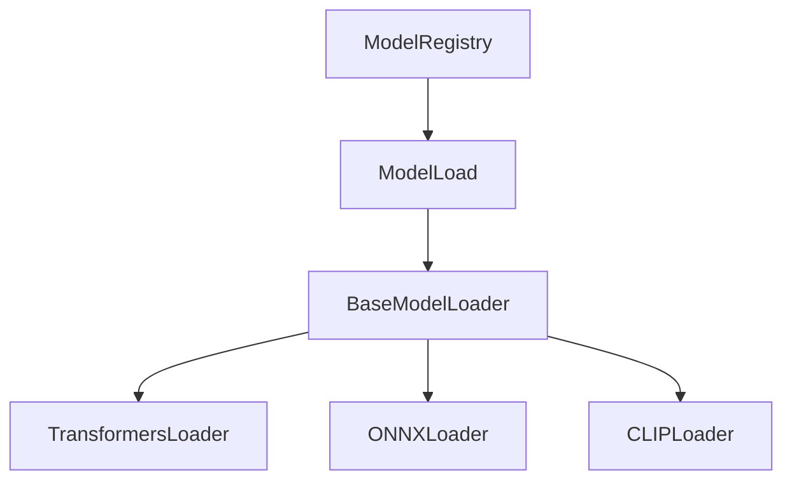

# memory-bank/productContext.md

## プロジェクト概要

`image-annotator-lib` は、`scorer_wrapper_lib` と `tagger_wrapper_lib` を統合し、画像アノテーション（タギングとスコアリング）機能を提供するライブラリです。

## プロジェクト目標

- コードの重複削減
- 統一された API の提供
- メンテナンス性の向上
- 機能拡張の容易化
- 特に `ModelLoad` (メモリ管理) と `ModelRegistry` (クラス登録) の共通化

## 主要コンポーネントとアーキテクチャ

- **3 層クラス階層**:
  1. `BaseAnnotator`: 全てのアノテーターに共通する基底クラス。共通の `predict` メソッドを提供。
  2. フレームワーク別基底クラス (`ONNXBaseAnnotator`, `TransformersBaseAnnotator`, `TensorflowBaseAnnotator`): 特定フレームワーク共通の処理を実装。
  3. 具象モデルクラス (`WDTagger`, `BLIPTagger`, `DeepDanbooruTagger`, 各 Scorer モデル): 個々のモデル固有の処理を実装。
- **`annotate` 関数 (`api.py`)**: ユーザー向けの主要 API 関数。複数モデル・複数画像の一括処理を提供。
- **`ModelLoad` (`core/model_factory.py`)**: モデルのロード、キャッシュ管理 (CPU 退避/CUDA 復元)、リソース解放を担当。
- **`ModelRegistry` (`core/registry.py`)**: モデルクラスを名前で登録・取得。
- **`core/utils.py`**: 設定ファイル (`annotator_config.toml`) の読み込みなど、共通ユーティリティ関数。
- **共通例外クラス (`exceptions/errors.py`)**: `AnnotatorError`, `ModelLoadError`, `OutOfMemoryError` など。

## 技術スタック

- Python >= 3.12
- PyTorch (Transformers, CLIP)
- ONNX Runtime
- TensorFlow (DeepDanbooru)
- TOML (設定ファイル)
- Ruff (フォーマッター、リンター)
- Mypy (型チェック)
- uv (パッケージ管理)

## 主要な依存関係 (pyproject.toml で管理)

- `toml`
- `requests`
- `huggingface_hub`
- `transformers`
- `onnxruntime` / `onnxruntime-gpu`
- `tensorflow`
- `Pillow`
- `numpy`
- `tqdm`
- `pytest` (テスト用)

## コーディング規約

- 言語: 日本語 (エラーメッセージ、ログ、コメント、Docstring)
- フォーマッター: Ruff format
- リンター: Ruff
- 型チェック: Mypy
- Docstring: Google スタイル (日本語)

## 現在の主要コンポーネント

### ModelLoad (改善中)

- **目的**: 機械学習モデルのロードとメモリ管理
- **新設計**:
  1. 基底ローダー層（BaseModelLoader）
     - 共通インターフェース定義
     - メモリ管理基本機能
  2. 具象ローダー層
     - モデルタイプ固有の実装
     - コンポーネント要件の明確化

### コンポーネント間の関係

### 設計原則

1. 責任の明確な分離
2. モデルタイプごとの独立性
3. 拡張性の確保
4. メモリ管理の一貫性

## 今後の展望

- 新しいモデルタイプへの対応
- メモリ管理の最適化
- テストカバレッジの向上
