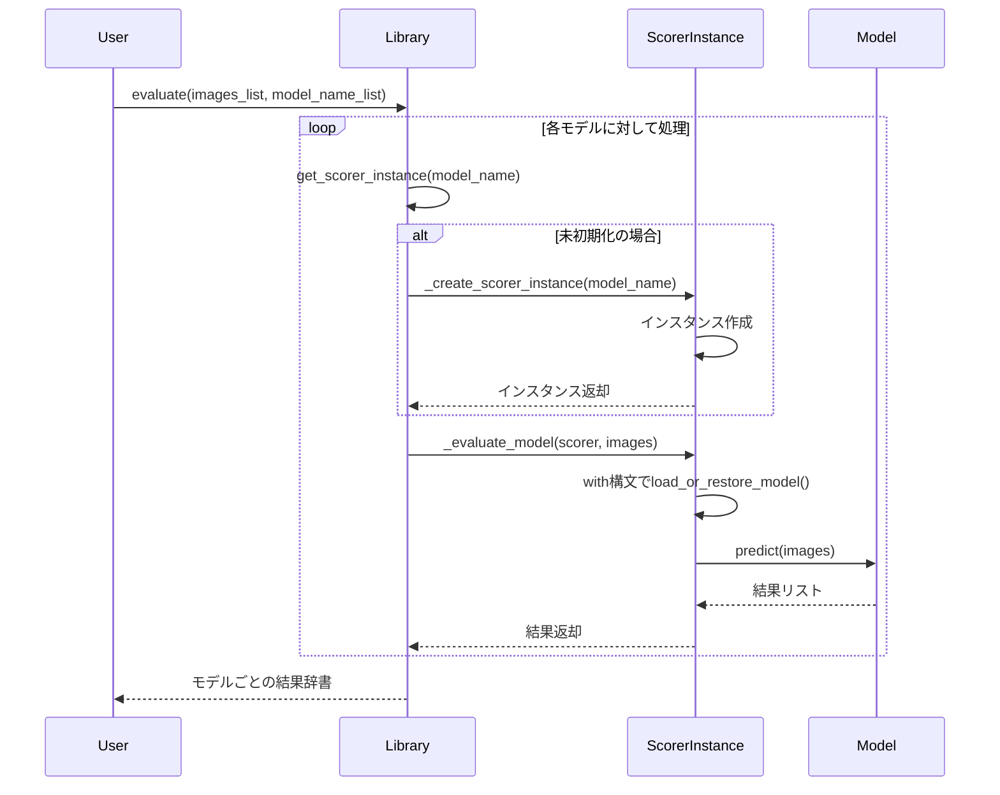

# Scorer Wrapper Library Detailed Design

本ドキュメントは、scorer_wrapper_lib の設計概要と実装計画を記述します。このライブラリは各種画像評価モデルを統一インターフェースで操作するための機能を提供します。

---

## 1. 概要

scorer_wrapper_lib は、各種美的評価モデル（例: Aesthetic Shadow, Cafe Aesthetic, ImageReward など）の操作を統一されたラッパー API として提供するライブラリです。ユーザーは本ライブラリを呼び出すことで、各モデルの初期化、画像前処理、推論といった処理を抽象化された関数群を通して利用できます。将来的には動画評価や高度なチェックリスト評価の統合も検討事項です。

---

## 2. 要求仕様と実装

- **使用可能なモデル一覧の取得**:

  - `list_available_models()` 関数で、利用可能なモデルの一覧を取得できます。
  - モデルは `config/models.toml` に定義され、動的にクラスが読み込まれます。

- **入力形式の統一**:

  - 画像入力は `PIL.Image` のリストとして受け付け、内部で必要な変換処理を行います。
  - モデル名はリスト形式で指定します。

- **画像評価の実行**:

  - `evaluate(images_list: list[Image.Image], model_name_list: list[str])` 関数で画像評価を実行します。
  - 戻り値は指定したモデルごとにグループ化され、各モデルの結果を辞書形式で取得できます。

- **モデルインスタンスの管理**:
  - モデルのインスタンスは内部的にキャッシュされ、必要時のみロード・復元されます。
  - リソースを効率的に使用するため、GPU/CPU メモリ間の移動を自動管理します。

---

## 3. アーキテクチャ設計

本ライブラリは、各美的評価モデルの初期化および推論処理を統一するために、以下の階層構造を採用しています。

1. **BaseScorer クラス**: すべてのスコアラーの基底クラスで、共通機能を実装

   - モデルの初期化・キャッシュ管理・リソース解放などの基本機能
   - Context Manager（with 文）のサポート

2. **モデルタイプ層**:

   - PipelineModel: パイプラインベースのモデル用基底クラス
   - ClipModel: CLIP 関連モデル用基底クラス

3. **具体的なモデル実装**:
   - AestheticShadowModel: Aesthetic Shadow の実装
   - CafeAestheticModel: Cafe Aesthetic Model の実装
   - ImageRewardModel: ImageReward モデルの実装
   - ClipAestheticModel: CLIP ベースの美的評価モデル

### 3.1 モデル登録と初期化システム

- スコアラークラスは `scorer_registry.py` によって自動的に収集・登録されます。
- 各モデルは `models.toml` 設定ファイルに基づき初期化され、インスタンスはキャッシュされます。

### 3.2 エラーハンドリング・ロギング戦略

- 専用の例外クラス（ScorerError, ModelLoadError など）により、明確なエラーメッセージを提供します。
- 標準の logging モジュールを使用し、適切なレベルでのログ出力を行います。

### 3.3 処理フロー



### 3.4 実際のコード実装例

```python
# スコアラーインスタンスの取得と管理
def get_scorer_instance(model_name: str) -> Any:
    """モデル名からスコアラーインスタンスを取得する

    モデルがすでにロードされている場合はキャッシュから返す。
    まだロードされていない場合は、新たにインスタンスを作成してキャッシュに保存する。

    Args:
        model_name: モデルの名前（models.tomlで定義されたキー）

    Returns:
        スコアラーインスタンス
    """
    if model_name in _MODEL_INSTANCE_REGISTRY:
        logger.debug(f"モデル '{model_name}' はキャッシュから取得されました")
        return _MODEL_INSTANCE_REGISTRY[model_name]

    instance = _create_scorer_instance(model_name)
    _MODEL_INSTANCE_REGISTRY[model_name] = instance
    return instance

# 評価の実行
def evaluate(images: list[Image.Image], model_list: list[str]) -> dict[str, list[dict[str, Any]]]:
    """画像評価の処理を実施します。
       ・各モデルに対して評価を実行し、最終的に結果を集約・グループ化します。

    Args:
        images: 評価対象の画像リスト
        model_list: 使用するモデルのリスト

    Returns:
        モデルごとにグループ化した結果
    """
    logger.info(f"{len(images)}枚の画像を{len(model_list)}個のモデルで評価します: {model_list}")
    results_by_model: dict[str, list[dict[str, Any]]] = {}

    for model_name in model_list:
        logger.info(f"モデル '{model_name}' での評価を開始します")
        scorer = get_scorer_instance(model_name)
        results = _evaluate_model(scorer, images)

        # 結果をモデルごとに集約
        for result in results:
            results_by_model.setdefault(model_name, []).append(result)
        logger.info(f"モデル '{model_name}' の評価が完了しました")

    return results_by_model
```

### 3.5 リソース管理と効率的なメモリ使用

```python
class BaseScorer(ABC):
    def __init__(self, model_name: str):
        self.model_name = model_name
        self.config: dict[str, Any] = load_model_config()[model_name]
        self.device = self.config["device"]
        self.model: dict[str, Any] = {}
        self.model_state = "unloaded"  # 初期状態: モデル未ロード
        self.logger = logging.getLogger(__name__)

    def __enter__(self) -> "BaseScorer":
        self.load_or_restore_model()
        return self

    def __exit__(self, exception_type: type[Exception], exception_value: Exception, traceback: Any) -> None:
        if self.is_on_gpu():
            self.cache_to_main_memory()

    def release_resources(self) -> None:
        """
        モデルリソースを完全に解放します。
        """
        if self.model:
            self._release_model()
            self.model = {}
            self.model_state = "unloaded"
            logger.info(f"モデル '{self.model_name}' のリソースを解放しました")
```

---

## 4. モジュール構成

実際の実装ディレクトリ構成:

```
scorer-wrapper-lib/
    ├── src/
    │   └── scorer_wrapper_lib/
    │       ├── __init__.py         // ライブラリのエントリーポイント（公開API）
    │       ├── scorer.py           // 評価実行のメイン処理
    │       ├── scorer_registry.py  // モデルクラスの登録と管理
    │       ├── core/
    │       │   ├── __init__.py
    │       │   ├── base.py         // BaseScorer基底クラスと継承クラス
    │       │   ├── utils.py        // 共通ユーティリティ
    │       │   └── model_factory.py// モデル作成とパラメータ管理
    │       ├── score_models/       // 各モデルの具体的実装
    │       │   ├── __init__.py
    │       │   ├── aesthetic_shadow.py
    │       │   ├── cafe_aesthetic.py
    │       │   ├── imagereward.py
    │       │   └── clipaesthetic.py
    │       └── exceptions/         // 例外定義
    │           ├── __init__.py
    │           └── model_errors.py
    ├── tests/                      // テスト
    │   ├── __init__.py
    │   ├── conftest.py
    │   ├── test_init_lib.py
    │   ├── test_utils.py
    │   ├── test_image_scoring.py
    │   ├── test_exceptions.py
    │   └── features/               // BDDテスト
    │       ├── image_scoring.feature
    │       ├── model_loading.feature
    │       ├── error_handling.feature
    │       └── cache_handling.feature
    ├── config/                     // 設定ファイル
    │   ├── models.json
    │   └── models.toml             // モデル設定
    ├── docs/                       // ドキュメント
    ├── pyproject.toml
    └── README.md
```

## 5. 今後の展望

1. **モデル追加の容易化**

   - モデル登録の自動化をさらに改善し、新規モデルの追加をより簡単にする

2. **パフォーマンス最適化**

   - バッチ処理の効率化と並列処理の強化

3. **テスト強化**

   - BDD テストのさらなる充実とカバレッジ向上

4. **インターフェース拡張**

   - より多様なユースケースに対応する API の拡張

5. **ドキュメントの充実**

   - ユーザーガイド、開発者ガイドの整備と充実

6. **モデル評価結果の視覚化ツール**
   - 評価結果を可視化するためのツールやユーティリティの追加
