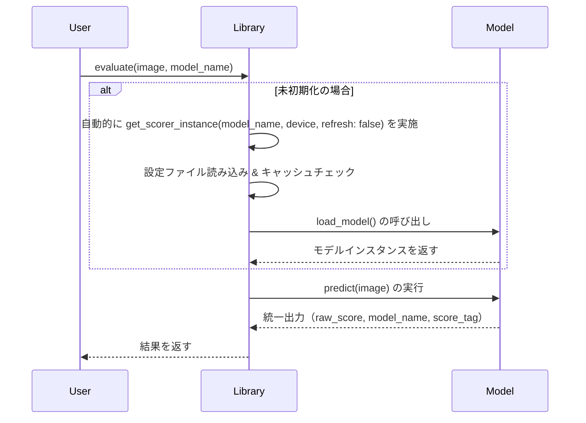

# Scorer Wrapper Library Detailed Design

本ドキュメントは、scorer_wrapper_lib の設計概要と実装計画を記述します。Pyproject.toml や実際に動作するコードを作成する前に、ライブラリの要求定義、モジュール構造、インターフェース仕様、エラーハンドリングやテスト戦略等について丁寧に設計することを目的とします。

---

## 1. 概要

scorer_wrapper_lib は、各種美的評価モデル（例: Aesthetic Shadow, Cafe Aesthetic, CLIP+MLP Aesthetic Predictor など）の操作を統一されたラッパー API として提供するライブラリです。ユーザーは本ライブラリを呼び出すことで、各モデルの初期化、画像前処理、推論といった処理を抽象化された関数群を通して利用できます。将来的には動画評価や高度なチェックリスト評価の統合も検討事項です。

---

## 2. 要求仕様（更新版）

- **使用可能なモデル一覧と動的更新**:

  - モデル一覧はキャッシュとリフレッシュ機能（例: refresh=true）により管理します。
  - リフレッシュ時は、内部で最新の設定ファイル（config/models.toml）を再読み込みし、必要に応じてモデルの再ダウンロードを実施します。

- **入力形式の統一**:

  - 画像入力は `PIL.Image` のリストとして受け付け、内部で自動的にバッチ処理へ変換します。
  - モデル名は単一（str）または複数（list[str]）に対応し、内部でリスト形式に統一します。

- **戻り値**:

  - `evaluate` 関数は統一フォーマット（例: `{"model_output": ..., "model_name": ..., "score_tag": ...}`）を返します。
  - 各モデル固有の出力は後処理関数で標準化し、処理日付は呼び出し側での登録を前提とします。

- **モデル初期化とキャッシュ機構**:
  - 明示的な初期化関数 `get_scorer_instance(model_name: str | list[str], device: str = "cpu", refresh: bool = False)` を実装。
  - 未初期化のモデルは `evaluate` 呼び出し時に自動初期化されます。また、refresh 指定時はキャッシュ無視で最新状態を保証します。

---

## 3. アーキテクチャ設計（更新版）

本ライブラリは、各美的評価モデルの初期化および推論処理を統一するために、下記の 2 層構造を採用します。

1. Base 層: 基底クラス（BaseScorer）で、共通処理（モデルの初期化、入力の正規化、出力の整形）を実装
2. Type 層: 新規抽象レイヤー「base_model_type」で、各モデルタイプ（例: Pipeline、CLIP+MLP、CLIP+Classifier）ごとの共通処理を定義
3. Model 層: 各具体的なモデルクラスが、Type 層の実装を拡張して固有処理を実装

この変更により、各処理手法間で入力画像の正規化や出力フォーマットの統一が容易となり、将来的な拡張および保守性が向上します。

### 3.1 モデル登録と初期化

- モデル設定は `config/models.toml` に記載し、`model_factory.py` により各クラスへ動的に振り分けます。
- 設定ファイルでは、モデルタイプ（例："pipeline", "clip_mlp", "clip_classifier" など）をキーに、対応するクラスの完全修飾名を指定します。

### 3.2 エラーハンドリング・ロギング戦略

- 専用の例外クラス（ScorerError など）を設け、エラー発生時に詳細なログを記録します。
- 標準の logging モジュールを用い、モジュール毎のログレベル設定を柔軟に変更可能とします。

### 3.3 処理フロー



### 3.4 モデルインスタンスの初期化と登録

- モデル初期化は lazy initialization 方式を採用し、評価要求発生時に未初期化のモデルを自動的に読み込みます。
- 各モデルは、src/scorer_wrapper_lib/core/model_factory.py 内の init_model 関数により初期化され、内部キャッシュ（MODEL_CACHE）に登録されます。
- 例: コンストラクタでデバイス指定を受け、 load_parameters() によりパラメータや重みを読み込みます。

```python
# filepath: /c:/LoRAIro/dataset-tag-editor-standalone/scorer-wrapper-lib/src/scorer_wrapper_lib/core/model_factory.py
MODEL_CACHE = {}

def init_model(model_name: str, device: str = "cpu", refresh: bool = False):
    # refresh指定または初期化されていない場合はモデルを新規読み込み
    if refresh or model_name not in MODEL_CACHE:
        model_class = get_model_class_from_config(model_name)
        model_instance = model_class(device=device)
        model_instance.load_parameters()  # パラメータの読み込み
        MODEL_CACHE[model_name] = model_instance
    return MODEL_CACHE[model_name]
```

### 3.5 モデルロードとシステムリソースの開放

- モデルロード後、システムリソース（例：GPU メモリ）が確保されるため、使用後のクリーンアップが必要です。
- 各モデルクラスではリソース解放用のメソッド release_resources() を実装し、不要になったモデルインスタンスはキャッシュから削除してリソースを解放します。
- 例: PyTorch の場合、torch.cuda.empty_cache() の呼び出しと追加クリーンアップ処理を実施。

```python
# filepath: /c:/LoRAIro/dataset-tag-editor-standalone/scorer-wrapper-lib/src/scorer_wrapper_lib/core/base.py
class BaseScorer:
    def __init__(self, device="cpu"):
        self.device = device
        # ...既存の初期化処理...

    def load_parameters(self):
        # モデルパラメータの読み込み処理
        # ...既存のコード...
        pass

    def release_resources(self):
        # GPU メモリなどシステムリソースの解放処理例（PyTorch の場合）
        # import torch
        # torch.cuda.empty_cache()
        # その他のクリーンアップ処理
        pass
```

---

## 4. モジュール構成

ディレクトリ構成例:

```
scorer-wrapper-lib/
    ├── src/
    │   └── scorer_wrapper_lib/
    │       ├── __init__.py
    │       ├── core/
    │       │   ├── __init__.py
    │       │   ├── base.py            // BaseScorer など共通クラス
    │       │   ├── base_model_type.py //  モデルごとの各サブクラスの実装
    │       │   ├── utils.py           // 共通ユーティリティ
    │       │   └── model_factory.py   // モデル初期化処理
    │       ├── score_models/         // 各モデルごとの独自の処理
    │       │   ├── __init__.py
    │       │   ├── aesthetic_shadow.py
    │       │   ├── cafe_aesthetic.py
    │       │   ├── improved_aesthetic_predictor.py
    │       │   └── waifu_aesthetic_classifier.py
    │       └── exceptions/
    │           ├── __init__.py
    │           └── errors.py
    ├── tests/
    │   ├── __init__.py
    │   ├── conftest.py
    │   ├── integration.py
    │   ├── test_aesthetic_shadow.py
    │   ├── test_cafe.py
    │   ├── test_clip_mlp.py
    │   ├── test_error_handling.py
    │   ├── test_model_loading.py
    │   ├── test_strategy.md
    │   ├── test_utils.py
    │   └── features/
    │       ├── error_handling.feature
    │       ├── feature_overview.md
    │       ├── image_scoring.feature
    │       ├── integration.feature
    │       └── model_loading.feature
    ├── config/                     # 設定ファイル
    │   └── models.toml             # モデルの設定
    ├── pyproject.toml
    ├── README.md
```

## 5. 今後の展望（順番と理由付き）

1.  **BDD シナリオの詳細化**

    - **理由**: ユーザーやステークホルダーと合意した受け入れ基準を明確にすることで、開発チーム全体の認識を統一できる。また、後続のテストケース作成や CI/CD の自動化に必要な具体的シナリオが確立できるため、最初に行うべきです。

2.  **モデル別のユースケースと仕様の補完**

    - **理由**: 各モデルの具体的な動作やエラーパターンの仕様を固めることで、BDD シナリオに対する実装の指針となる。具体的な実装範囲やテストケースが明確になり、正確なコード設計が可能になるため、BDD シナリオの詳細化の次に行います。

3.  **テスト戦略の強化**

    - **理由**: 事前に合意されたシナリオとモデル仕様に基づいて、単体テスト・統合テスト・End-to-End テストの設計を進める必要があります。これにより、実装の品質が担保され、問題発生時の早期検知につながるため、仕様が固まった後に取り組みます。

4.  **CI/CD パイプラインの整備**

    - **理由**: テスト戦略が強化され、各種テストケースが整った段階で、自動化されたテスト実行環境を構築することで、開発の効率や信頼性を高めることができます。CI/CD は変更のたびに安定性の検証を行うため、テスト戦略の後に設定するのが適切です。

5.  **ドキュメントの全体統一と充実**

    - **理由**: 以上の各フェーズで得られた情報や仕様、プロセスを一元化し、開発者やユーザーに向けたガイドラインを整備します。全体の見通しを明確にするため、CI/CD およびテストの仕組みが整った後に統一文書化を行うべきです。

6.  **例外処理・ロギング方針の確立**
    - **理由**: 全体の設計・実装が固まった段階で、各モジュールで発生し得るエラーに対する統一的な処理ルールとログ記録の仕組みを構築することで、運用中の問題解決が迅速になるため、最後に取り組みます。
